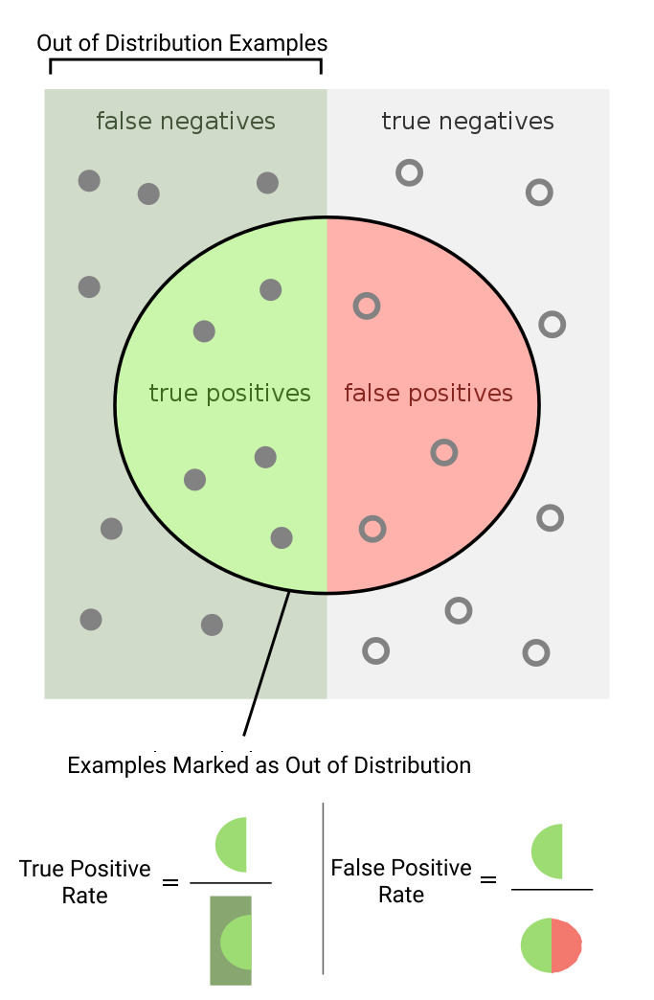

Introduction
============

One common project within the machine learning community involves
developing an image classifier for distinguishing cats and dogs.
Students practice building a convolutional base, gluing a few fully
connected layers on top, and training on a [Kaggle
dataset](https://www.kaggle.com/c/dogs-vs-cats). Some ambitious students
may even deploy their classifier using a phone app for a real-world pet
classifier. Yet upon collision with the real world, their model fails in
a very predictable way. When fed an image of a hamster, the classifier
is unable to answer “hamster” but must output a probability distribution
of the “cat” and “dog” options. Any answer which the classifier produces
will therefore be meaningless.

The image of a hamster is considered “out-of-distribution” (OOD) for a
cats-and-dogs classifier. It is an example of a way that the testing
distribution differs from the training distribution. This example image
is indescribable by the model. However, even if this weren’t the case,
OOD examples often reduce the quality of model outputs. Perhaps the
classifier is trained only on certain breeds of cats. When testing on an
unseen breed, the classifier will find it more difficult to
generalize—often achieving lower accuracy than expected.

One approach to dealing with out-of-distribution examples is to do
“out-of-distribution detection” (OOD detection). We build mechanisms
into the model so that the model produces both a prediction and a
confidence score. Then we set the threshold to a certain point such that
any input which produces a lower confidence score is flagged as an OOD
example. In such cases, external systems can audit the prediction of the
model, potentially discarding or overriding it. Through OOD detection,
we minimize the threat that OOD examples pose.

Problem
=======

To be precise, we have some model *f**θ*(*x*) which outputs a
result and an auxiliary confidence score for each input. We train this
model on some dataset 𝒟*t**r**a**in* and test it on a
testing set 𝒟*test*. Because we have access to the
training set, we know that 𝒟*t**r**a**in* consists of only
in-distribution data. However, to simulate real-world conditions, we
have that 𝒟*test* is composed of an in-distribution set
𝒟*in**test* and an out-of-distribution set
𝒟*o**u**t**test* shuffled together.

Let *s*1, ..., *s**n* and
*s*’1, …, *s*’*n* be the confidence scores for
𝒟*in**test* and
𝒟*o**u**t**test* respectively. Out of
distribution detection involves ensuring that the distribution
*s*1, …, *s**n* is maximally far from
*s*’1, …, *s*’*n*. Then all scores above a certain
threshold *t* are considered out-of-distribution, whereas all scores
below *t* are considered in-distribution. In practice, the threshold *t*
is not fixed but dynamically generated based on the score distribution
of the training set (e.g., the 95% percentile of
𝒟*in**test*). We begin by establishing a
few metrics and then discuss common benchmarks that people use.

Metrics
-------

In OOD detection, there are a few specialized metrics that we use.
Noticeably, accuracy is not a common metric. The issue with accuracy is
that out-of-distribution examples may be really rare. If only 1% of the
data is out-of-distribution, then a model which predicts
“in-distribution” for each data point will have a 99% accuracy. In other
words, total accuracy is a bad metric for rare events. Instead, OOD
detection traditionally uses other metrics. In these notes we focus on
the two most common: FPR 95 and AUROC.

### Prerequisites

To understand these metrics, we first must understand two concepts:
false positive rate and true positive rate. Our context is analogous to
running a test on different images to detect out-of-distribution
examples. A “positive” means an image has been marked as
out-of-distribution, whereas a “negative” means an image has been marked
as in-distribution. False positive rate is the proportion of positives
which should be negatives (e.g., the proportion of positives in which
the image is actually in-distribution). True positive rate is the
probability that an out-of-distribution image will be positive (that the
image which should be positive actually gets marked positive).

### FPR 95

One of the primary metrics to measure OOD detection quality is FPR 95,
which shows false positive rate at 95% true positive rate. Essentially,
we set the out-of-distribution threshold *t* such that we detect 95% of
the out-of-distribution data
𝒟*o**u**t**test*. Then, out of the examples
marked as out-of-distribution, we measure the proportion which are
actually in-distribution 𝒟*in**test*.

For instance, in the cats-vs-dogs example, we might collect a dataset of
cats and dogs 𝒟*in**test* and a dataset of
hamsters 𝒟*o**u**t**test*. Then for FPR 95,
we find the threshold *t* which classifies 95% of the hamsters as
out-of-distribution. Finally, we see the proportion of cat/dog images
which as classified as out-of-distribution along with the hamsters. Note
that the 95% threshold is somewhat arbitrary. Other papers have used FPR
90 and, in principle, any FPR *N* could exist. However, FPR 95 is the
current community standard.

<figure>
<figcaption aria-hidden="true">True positive rate vs false positive rate.</figcaption>
</figure>

### AUROC

The issue with FPR 95 is that the 95 threshold is somewhat arbitrary and
doesn’t reflect the model’s OOD detection abilities over all other
thresholds. Another metric, AUROC, fixes this by being
threshold-invariant. Specifically, the receiver operating curve (ROC) is
the curve which graphs the true positive rate against the false positive
rate. The area under the ROC (AUROC) measures the total area under the
curve. Whereas FPR 95 corresponds to one point (one threshold), AUROC
incorporates the model’s OOD detection over all thresholds. See figure
for a visualization of this effect. AUROC can also be interpreted as the
probability that a clean image has a higher confidence score than an
anomaly. An AUROC of 0.5 is random, and an AUROC of 1.0 corresponds to a
completely solved task.

Benchmarks
----------

Unlike other disciplines which require the careful curation of datasets,
out-of-distribution detection doesn’t need carefully crafted benchmarks.
Simply take two datasets, label one as in-distribution and one as
out-of-distribution, and *voila!*, an out-of-distribution detection
benchmark is formed. Alternatively, another common way to generate
out-of-distribution detection benchmarks is to train a model to
recognize only a single class within a dataset. All other examples from
all other classes are treated as out-of-distribution. This technique is
dubbed *one-class classification* and is unique in that it requires
unsupervised out-of-distribution detection methods. (This fact is
because all the in-distribution examples the model sees is from the same
class.)

This ease of creation means that out-of-distribution detection can be
applied to many different domains—images, text, audio, genomic data,
etc. However, it also means that setting up common standards of
comparison is a bit more difficult than usual. For now, we focus on the
canonical set of image classification datasets. Keep in mind that the
right benchmarks to evaluate on will differ from domain to domain.

### Image Classification

In image classification, OOD detection methods are validated on a
variety of small datasets (32x32 pixels). Common datasets for this
small-scale evaluation include Cifar10 (Krizhevsky 2009), Cifar100
(Krizhevsky 2009), Street View House Numbers (SVHN) (Netzer et al.
2011), TinyImageNet (Le and Yang 2015), Large-scale Scene Understanding
(LSUN) (Yu et al. 2016). Usually, either Cifar10 or SVHN is
in-distribution and the remaining are out-of-distribution. Cifar10 is
also commonly used for one-class classification. In general, the more
similar the two datasets are, the more difficult OOD detection is. For
example, when training on Cifar10, detecting SVHN outliers is easier
than Cifar100 outliers. At a larger scale, researchers often use
ImageNet-1K (the default ImageNet with a thousand classes) (Deng et al.
2009), ImageNet-22K (a superset of ImageNet with 22 thousand classes)
(Deng et al. 2009), and LSUN (large scale scene understanding) (Yu et
al. 2016). Large-scale one-class classification is often done with
either ImageNet-1K or ImageNet-22K. Figure visualizes all of these
datasets.

Approaches
==========

Maximum Softmax Probability
---------------------------

Maximum Softmax Probability (MSP) is an intuitive baseline for finding
confidence scores (Hendrycks and Gimpel 2018). We simply let the
confidence be the maximum of the classifier’s final softmax. For
instance, if our cats and dogs classifier outputted a result of \[0.8,
0.2\], then the MSP confidence would be 0.8. In general, we have that
the confidence score *s* of example *x* is as follows

$$*s* = max *f**θ*(*x*)$$

MSP is a simple method which can sometimes be surprisingly useful.
However, usually MSP is ineffective and compared against as a baseline.
Outperforming MSP means that, at the very least, your method can
outperform the naive solution.

Outlier Exposure
----------------

Outlier exposure is a technique to improve out-of-distribution detection
algorithms by exposing them to example outliers (Hendrycks, Mazeika, and
Dietterich 2019). Consider the example of the cats vs dogs classifier.
With outlier exposure, we collect an auxiliary out-of-distribution set,
perhaps a dataset of chairs. Then, during training, we teach the model
to have low confidence on this auxiliary out-of-distribution set.
Finally, during testing, we must test the model’s out-of-distribution
detection on out-of-distribution examples that the model has not seen
before. Out-of-distribution detection is meant to catch the model’s
blind spots which requires testing on new out-of-distribution examples,
not ones that the model’s seen before.

More formally, we now have three datasets, 𝒟*in*,
𝒟*o**u**t**a**u**x*,
𝒟*o**u**t**test*. We train the classifier
using the in-distribution and the auxiliary dataset using the following
loss template:

$$𝔼*x*, *y* ∼ 𝒟*in*\[ℒ(*f**θ*(*x*), *y*) + *λ*𝔼*x*′ ∼ 𝒟*o**u**t**a**u**x*\[ℒ*O**E*(*f**θ*(*x*′), *f**θ*(*x*), *y*)\]\]$$

where you can fill ℒ and ℒ*O**E* in different ways depending
on the situation. For image classification, ℒ is often cross-entropy and
ℒ*O**E* often measures the KL divergence between
*f**θ*(*x*′) and a uniform distribution.

After training the model, we test out-of-distribution detection on
𝒟*o**u**t**test*. Interestingly enough, the
authors note that 𝒟*o**u**t**a**u**x* does not
need to be close to 𝒟*o**u**t**test* in
order for outlier exposure to improve OOD detection. Instead, the
auxiliary dataset actually has to be sufficiently close to the
in-distribution dataset, 𝒟*in*, so that the classifier
doesn’t simply learn very simple patterns. Beyond that, the diversity of
the auxiliary dataset also matters. The more diverse the auxiliary
dataset, the better the model understands what counts as in-distribution
and out-of-distribution.

Generative Modeling
-------------------

Generative models can also be used for out-of-distribution detection;
however, they seem less useful than discriminative methods. There are
two ways to use generative models for OOD detection. The first involves
generating OOD images and training one’s classifier to have less
certainty on these images (Lee et al. 2018a). Although moderately
effective, simply doing outlier exposure using a diverse auxiliary set
outperforms this method.

The second way to use generative models are to leverage the generative
model’s likelihood scores directly as a measure of uncertainty. You can
use flows (Nalisnick et al. 2019; Kirichenko, Izmailov, and Wilson
2020), autoregressive/feedfoward models (Nalisnick et al. 2019; Chen et
al. 2020), energy-based models (Liu et al. 2021), or even variational
autoencoders (Nalisnick et al. 2019; Xiao, Yan, and Amit 2020).[1] Each
of these can take an image and produce a confidence score. However, one
common pattern is that likelihood scores also degrade on
out-of-distribution inputs, with generative models sometimes giving
higher likelihood to out of distribution images (Nalisnick et al. 2019;
Choi, Jang, and Alemi 2019; Kirichenko, Izmailov, and Wilson 2020).
Currently, this phenomena is not well-understood, although some have
argued that it is a consequence of the generative models’ inductive
biases (Kirichenko, Izmailov, and Wilson 2020). Either way, papers which
use generative models are forced to propose tricks to get the
out-of-distribution detection working. These tricks provide moderate
increases in performance but do not trump the state-of-the-art
discriminative out-of-distribution detection methods.

There are two major exceptions to this pattern. To start, one
energy-based method incorporate an outlier exposure approach and
explicitly trains on out-of-distribution examples (Liu et al. 2021).
This approach is shown to outperform outlier exposure. Additionally,
\[iGPT\].

Self Supervised Learning
------------------------

Another approach to OOD detection involves using self-supervised
learning to measure whether the model understands the internal structure
within the data (Hendrycks et al. 2019; Tack et al. 2020; Yoon et al.
2021). Self-supervised learning involves generating a supervised
learning task without any external labels, using only the unlabeled
data. For instance, one self-supervised learning task might involve
taking a set of images, rotating them
$0 \\degree, 90 \\degree, 180 \\degree$, or $270\\degree$, and using
your model to predict the rotation. Effectively, self-supervised
learning measures whether a model understands the internal structure of
the data. Then, performance on the self-supervised learning task is a
good measure of out-of-distribution. As images become more and more out
of distribution, the model understands the internal structure of the
image less and less, leading to poor performance on the SSL tasks.

In this set of notes, we explore papers which use self-supervised
learning for out-of-distribution detection. For instance, a paper from
2019 (Hendrycks et al. 2019) used three distinct self-supervised tasks:
rotation ($0 \\degree, 90 \\degree, 180 \\degree, 270 \\degree$),
horizontal translation (-8, 0, +8 pixels), and vertical translation (-8,
0, +8 pixels). Here, performance on these tasks is used as an anomaly
score: the worse the model does, the more out-of-distribution the
example is marked. The paper demonstrates that a network trained to
identify only rotation (RotNet) can already outperform outlier exposure
on OOD detection for one-class ImageNet. However, by incorporating the
other self-supervised tasks and a few architectural tricks, the model is
able to drastically outperform this baseline as well. Later works expand
on this paper by incorporating new tricks and self-supervised tasks
(Tack et al. 2020; Yoon et al. 2021).

Future work in using self-supervised learning for out-of-distribution
detection will likely continue trying out novel self-supervised learning
tasks (He et al. 2021), including self-supervised learning tasks on
different modalities (Devlin et al. 2019).

Statistical
-----------

Finally, others have explored other miscellaneous approaches to do
out-of-distribution robustness (Liang, Li, and Srikant 2020; Lee et al.
2018b). For example, one paper notices that in-distribution examples
often are more susceptible to adversarial perturbations than
out-of-distribution examples (Liang, Li, and Srikant 2020). Their
technique, titled ODIN, involves applying a large softmax temperature of
1000 and generating adversarial perturbations. Together, these changes
provide a very strong out-of-distribution detector. That being said,
it’s unclear why the adversarial perturbations have different behavior
on in-distribution and out-of-distribution examples.

Another paper reframes the classification problem using a generative
classifier (Lee et al. 2018b). Specifically, given a feature mapping
*f*(*x*) which maps some example to a feature space, we can create a
classifier using the generative models *P*(*X*|*Y* = *y*). Specifically,
we have that

$$P(Y = y|X) = \\frac{P(Y=y)P(X|Y=y)}{\\sum\_c P(Y=c)P(X|Y=c)}.$$

In other words, we classify each example by seeing how likely they are
to appear given different labels. We then weight this by priors on the
class distribution to get our final probability. To construct
*P*(*X*|*Y* = *c*), we introduce some assumptions. We assume that each
generative model can be represented as a multivariate normal
distribution and that the variance across all distributions are same. In
other words, *P*(*X*|*Y* = *c*) = 𝒩(*μ**c*, *Σ*) for all
class *c*. Then, we estimate the mean and variance as follows.

$$\\hat{\\mu}\_c = \\frac{1}{N\_c} \\sum\_{i:y\_i=c} f(x\_i), \\hat{\\Sigma} = \\frac{1}{N} \\sum\_c \\sum\_{i:y\_i = c} (f(x\_i) - \\hat{\\mu\_c})(f(x\_i) - \\hat{\\mu\_c})^\\top$$

Finally, using this formulation, we can generate a
statistically-motivated confidence measure named Mahalanobis distance,
defined as the following.

$$M(x) = \\max\_c - (f(x) - \\hat{\\mu\_c})^\\top \\hat{\\Sigma}^{-1}(f(x) - \\hat{\\mu\_c})$$

If interested in this technique, we would especially recommend reading
the paper, as they use many tricks which are not mentioned here (such as
aggregating multiple confidence scores across different feature
mappings).

Other Frameworks
----------------

Finally, in the readings, one might come across the terms "anomaly
detection" or "novelty detection" or "outlier detection." These terms
are largely synonymous with each other and have a very similar meaning
to out-of-distribution detection. In particular, one prominent
literature review defines them as "finding patterns in data that do not
conform to expected behavior" (Chandola, Banerjee, and Kumar 2009).
Moreover, some papers use them interchangably with "out-of-distribution
detection." That being said, there is a subtle distinction between the
two sets of terms. From our perspective, anomaly detection, novelty
detection, or outlier detection imply the action of finding natural
anomalies within a single dataset. On the other hand,
out-of-distribution detection implies the action of introducing
artificial anomalies by pulling from an out-distribution set.

Conclusion
==========

Out-of-distribution detection is essential for models to be cognisant of
their own limitations. Currently, there exist many approaches to
achieving out-of-distribution detection; however, it is unclear which
approaches have longevity. We’re most bullish on self-supervised
learning but believe that both statistical approaches and \[iGPT\] have
the potential to dominate in a few years. Crucially, scaling laws with
respect to out-of-distribution detection have not been found yet, so
better out-of-distribution performance must currently come from
algorithmic innovation. If such scaling laws were found, this discovery
would change the field overnight. The out-of-distribution approaches
which best leverage scaling would establish themselves as the dominant
paradigm. On the other hand, if such laws were not found or do not
exist, then we anticipate that out-of-distribution detection will
continue to be a diverse field with very different approaches which all
have similar performance. Either way, we anticipate out-of-distribution
detection to continue to grow as more and more real-world machine
learning systems are deployed.

References
==========

Chandola, Varun, Arindam Banerjee, and Vipin Kumar. 2009. “Anomaly
Detection: A Survey.” *ACM Comput. Surv.* 41 (July).
<https://doi.org/10.1145/1541880.1541882>.

Chen, Mark, Alec Radford, Rewon Child, Jeffrey Wu, Heewoo Jun, David
Luan, and Ilya Sutskever. 2020. “Generative Pretraining from Pixels.” In
*Proceedings of the 37th International Conference on Machine Learning*,
edited by Hal Daumé III and Aarti Singh, 119:1691–1703. Proceedings of
Machine Learning Research. PMLR.
<https://proceedings.mlr.press/v119/chen20s.html>.

Choi, Hyunsun, Eric Jang, and Alexander A. Alemi. 2019. “WAIC, but Why?
Generative Ensembles for Robust Anomaly Detection.”
<http://arxiv.org/abs/1810.01392>.

Deng, Jia, Wei Dong, Richard Socher, Li-Jia Li, Kai Li, and Li Fei-Fei.
2009. “ImageNet: A Large-Scale Hierarchical Image Database.” In *2009
IEEE Conference on Computer Vision and Pattern Recognition*, 248–55.
<https://doi.org/10.1109/CVPR.2009.5206848>.

Devlin, Jacob, Ming-Wei Chang, Kenton Lee, and Kristina Toutanova. 2019.
“BERT: Pre-Training of Deep Bidirectional Transformers for Language
Understanding.” *ArXiv* abs/1810.04805.

He, Kaiming, Xinlei Chen, Saining Xie, Yanghao Li, Piotr Dollár, and
Ross Girshick. 2021. “Masked Autoencoders Are Scalable Vision Learners.”
<http://arxiv.org/abs/2111.06377>.

Hendrycks, Dan, and Kevin Gimpel. 2018. “A Baseline for Detecting
Misclassified and Out-of-Distribution Examples in Neural Networks.”
<http://arxiv.org/abs/1610.02136>.

Hendrycks, Dan, Mantas Mazeika, and Thomas G. Dietterich. 2019. “Deep
Anomaly Detection with Outlier Exposure.” *ArXiv* abs/1812.04606.

Hendrycks, Dan, Mantas Mazeika, Saurav Kadavath, and Dawn Xiaodong Song.
2019. “Using Self-Supervised Learning Can Improve Model Robustness and
Uncertainty.” In *NeurIPS*.

Kirichenko, Polina, Pavel Izmailov, and Andrew Gordon Wilson. 2020. “Why
Normalizing Flows Fail to Detect Out-of-Distribution Data.”
<http://arxiv.org/abs/2006.08545>.

Krizhevsky, Alex. 2009. “Learning Multiple Layers of Features from Tiny
Images.”

Le, Ya, and Xuan S. Yang. 2015. “Tiny ImageNet Visual Recognition
Challenge.” In.

Lee, Kimin, Honglak Lee, Kibok Lee, and Jinwoo Shin. 2018a. “Training
Confidence-Calibrated Classifiers for Detecting Out-of-Distribution
Samples.” <http://arxiv.org/abs/1711.09325>.

Lee, Kimin, Kibok Lee, Honglak Lee, and Jinwoo Shin. 2018b. “A Simple
Unified Framework for Detecting Out-of-Distribution Samples and
Adversarial Attacks.” In *Proceedings of the 32nd International
Conference on Neural Information Processing Systems*, 7167–77. NIPS’18.
Red Hook, NY, USA: Curran Associates Inc.

Liang, Shiyu, Yixuan Li, and R. Srikant. 2020. “Enhancing the
Reliability of Out-of-Distribution Image Detection in Neural Networks.”
<http://arxiv.org/abs/1706.02690>.

Liu, Weitang, Xiaoyun Wang, John D. Owens, and Yixuan Li. 2021.
“Energy-Based Out-of-Distribution Detection.”
<http://arxiv.org/abs/2010.03759>.

Nalisnick, Eric, Akihiro Matsukawa, Yee Whye Teh, Dilan Gorur, and
Balaji Lakshminarayanan. 2019. “Do Deep Generative Models Know What They
Don’t Know?” <http://arxiv.org/abs/1810.09136>.

Netzer, Yuval, Tao Wang, Adam Coates, Alessandro Bissacco, Bo Wu, and
Andrew Y. Ng. 2011. “Reading Digits in Natural Images with Unsupervised
Feature Learning.”
<http://ufldl.stanford.edu/housenumbers/nips2011_housenumbers.pdf>.

Tack, Jihoon, Sangwoo Mo, Jongheon Jeong, and Jinwoo Shin. 2020. “CSI:
Novelty Detection via Contrastive Learning on Distributionally Shifted
Instances.” *ArXiv* abs/2007.08176.

Xiao, Zhisheng, Qing Yan, and Yali Amit. 2020. “Likelihood Regret: An
Out-of-Distribution Detection Score for Variational Auto-Encoder.”
<http://arxiv.org/abs/2003.02977>.

Yoon, Jinsung, Kihyuk Sohn, Chun-Liang Li, Sercan Ö. Arik, Chen-Yu Lee,
and Tomas Pfister. 2021. “Self-Trained One-Class Classification for
Unsupervised Anomaly Detection.” *ArXiv* abs/2106.06115.

Yu, Fisher, Ari Seff, Yinda Zhang, Shuran Song, Thomas Funkhouser, and
Jianxiong Xiao. 2016. “LSUN: Construction of a Large-Scale Image Dataset
Using Deep Learning with Humans in the Loop.”
<http://arxiv.org/abs/1506.03365>.

[1] At the time of writing, score based models have not yet been
extensively tested.
